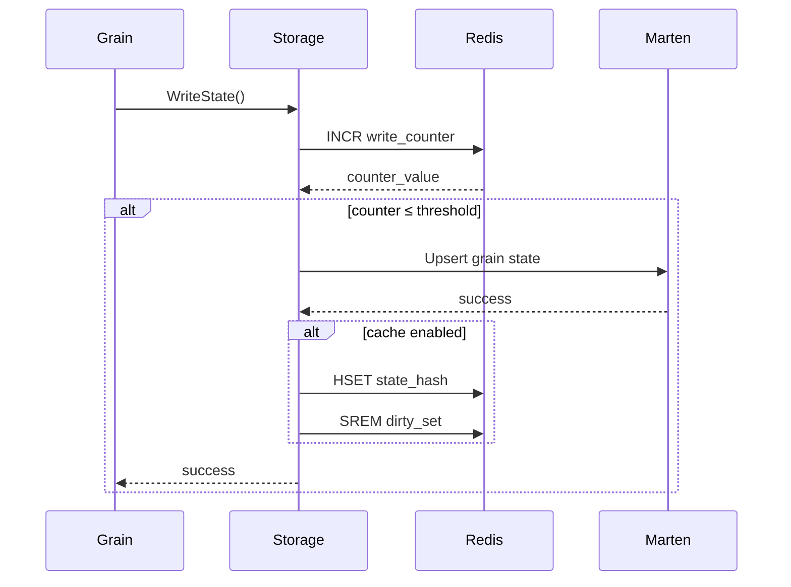
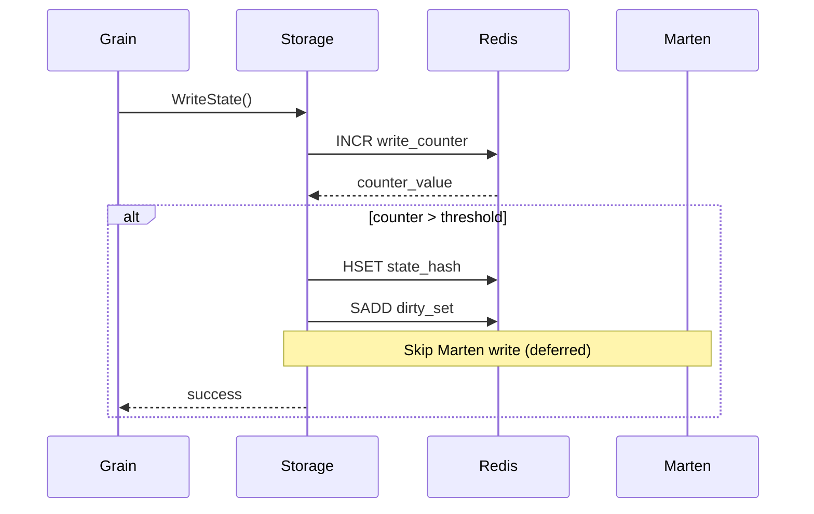
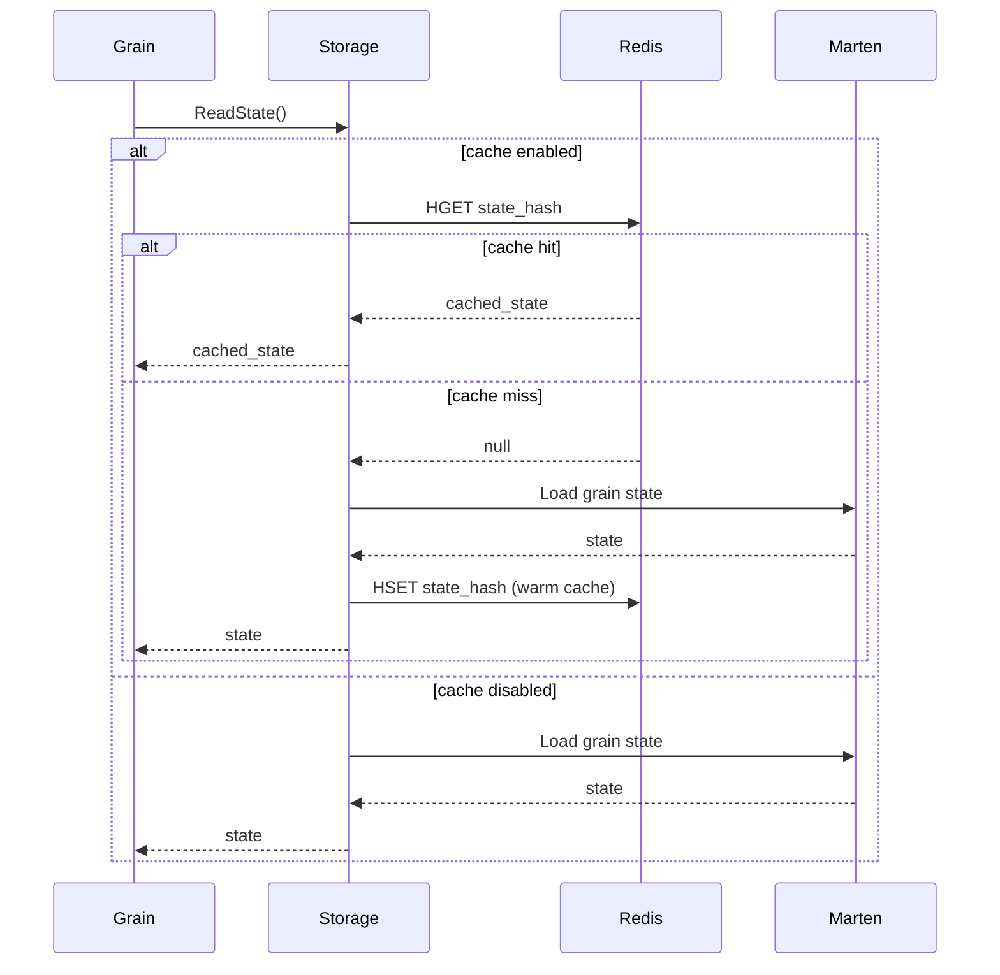
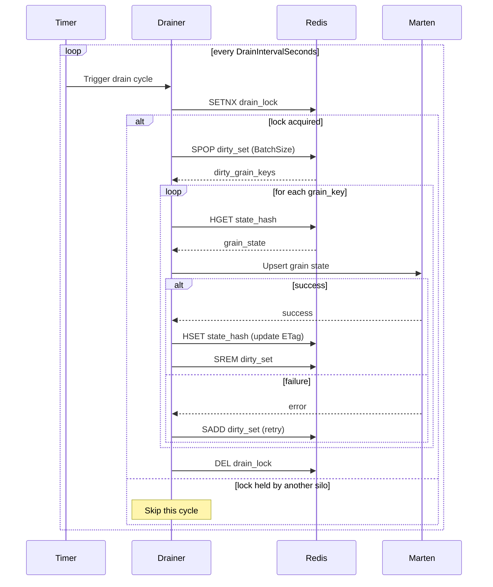

# Elyfe.Orleans.Marten.Persistence

Orleans grain storage implementation using Marten (PostgreSQL document store) with optional Redis read-through cache and write-behind overflow.

## Features

- **Marten-backed grain storage**: Persistent grain state in PostgreSQL using Marten document store
- **Redis read-through cache**: Optional caching layer for improved read performance
- **Write-behind overflow**: Automatic overflow to Redis cache during write surges (>100 writes/sec)
- **Background drainer**: Asynchronous persistence from Redis to Marten
- **Multi-tenant support**: Tenant isolation via Orleans RequestContext
- **ETag-based concurrency**: Optimistic concurrency control with SHA-256 ETags
- **Backward compatibility**: Automatic migration from old grain ID format

## Quick Start

### Basic Usage (Marten only)

```csharp
siloBuilder.AddMartenGrainStorage("Default");
```

### With Redis Cache and Write-Behind

```csharp
siloBuilder.AddMartenGrainStorageWithRedis("Default", options =>
{
    options.Threshold = 1000;           // Write surge threshold (writes/sec)
    options.BatchSize = 100;            // Drainer batch size
    options.DrainIntervalSeconds = 5;   // Drain check interval
    options.StateTtlSeconds = 300;      // Cache TTL (0 = no expiration)
    options.EnableWriteBehind = true;   // Enable overflow
    options.EnableReadThrough = true;   // Enable cache reads
});
```

## Configuration

### appsettings.json

```json
{
  "ConnectionStrings": {
    "cache": "localhost:6379"
  },
  "WriteBehind": {
    "CacheDatabase": 1,
    "Threshold": 1000,
    "BatchSize": 100,
    "DrainIntervalSeconds": 5,
    "StateTtlSeconds": 300,
    "DrainLockTtlSeconds": 30,
    "EnableWriteBehind": true,
    "EnableReadThrough": true
  }
}
```

### Environment Variables

- `ConnectionStrings__cache`: Redis connection string (if empty, caching is disabled)
- `WriteBehind__CacheDatabase`: Redis database number (default: 0)`
- `WriteBehind__Threshold`: Write surge threshold (default: 1000)
- `WriteBehind__BatchSize`: Drainer batch size (default: 100)
- `WriteBehind__DrainIntervalSeconds`: Drain check interval (default: 5)
- `WriteBehind__StateTtlSeconds`: Cache TTL in seconds (default: 300)
- `WriteBehind__DrainLockTtlSeconds`: Drain lock TTL in seconds (default: 30)
- `WriteBehind__EnableWriteBehind`: Enable write-behind overflow (default: true)
- `WriteBehind__EnableReadThrough`: Enable read-through cache (default: true)

## Architecture

### Redis Data Model

The implementation uses a Hash + Set coalescing pattern:

1. **State Hash** (per storage/tenant): `mgs:{serviceId}:{storageName}{tenantPart}:state`
   - Field: `{grainKey}` (grain ID with slashes replaced by underscores)
   - Value: JSON `{ data, etag, lastModified }`

2. **Dirty Set** (per storage/tenant): `mgs:{serviceId}:{storageName}{tenantPart}:dirty`
   - Members: grain keys pending persistence

3. **Write Counter** (per storage): `mgs:{serviceId}:{storageName}:wcount`
   - Auto-incremented on each write
   - Expires after 1 second
   - Triggers overflow when > Threshold

4. **Drain Lock** (per storage): `mgs:{serviceId}:{storageName}:drain-lock`
   - Distributed lock for drainer coordination
   - TTL: 30 seconds (configurable)

### Write Paths

#### Write-Through (Normal Operation)



#### Write-Behind (Overflow)



### Read Path



### Background Drainer



## Tenant Isolation

Tenant ID is resolved from Orleans `RequestContext`:

```csharp
var tenantId = RequestContext.Get("tenantId") as string;
```

When present, Redis keys include `:tenant:{tenantId}` for isolation. The write counter remains global per storage (cluster-wide threshold).

## Failure Modes & Consistency

| Scenario | Behavior | Durability |
|----------|----------|------------|
| Cache read failure | Fall back to Marten | ✅ No data loss |
| Cache write failure during overflow | Synchronous write to Marten | ✅ No data loss |
| Drainer failure | Grain remains dirty, retried next cycle | ✅ Eventual consistency |
| Marten write failure | Exception propagated to grain | ✅ No data loss |
| Redis unavailable | Cache disabled, Marten-only mode | ✅ No data loss |

### Consistency Guarantees

- **Durability**: All successful grain writes are eventually persisted to Marten
- **Read-after-write**: Reads always return the latest state (cache or DB)
- **Idempotency**: Drainer upserts are idempotent
- **No data loss**: On cache failures during overflow, fallback to synchronous Marten write

## Operations

### Monitoring

Key metrics to monitor:

- **Cache hit rate**: Log level `Debug` shows "Cache hit for grain..."
- **Overflow events**: Log level `Debug` shows "Write overflow detected..."
- **Drain cycles**: Log level `Information` shows "Draining X dirty grain states..."
- **Failures**: Log level `Error` for cache/drain failures

### Scaling

- Write threshold applies **cluster-wide** per storage name
- Multiple silos can drain concurrently (distributed lock coordination)
- Redis and Marten can be scaled independently

### Disabling Cache

Set `ConnectionStrings:Redis` to empty string:

```json
{
  "ConnectionStrings": {
    "Redis": ""
  }
}
```

Cache features are automatically disabled; falls back to Marten-only mode.

### Tuning

| Parameter | Impact | Recommendation |
|-----------|--------|----------------|
| `Threshold` | Lower = more overflow | Set to 1.2x expected peak writes/sec |
| `BatchSize` | Larger = fewer cycles | 50-200 depending on grain size |
| `DrainIntervalSeconds` | Lower = less lag | 5-10 seconds typical |
| `StateTtlSeconds` | Longer = more cache hits | 300-600 for hot grains |

## Testing

### Unit Tests

```bash
dotnet test --filter Category=Unit
```

Tests cover:
- Key generation and formatting
- Write counter gating logic
- Cache operations (read/write/dirty/lock)
- ETag generation

### Integration Tests

```bash
dotnet test --filter Category=Integration
```

Tests use Testcontainers (PostgreSQL + Redis) and verify:
- Read-through cache behavior
- Write-behind overflow path
- Background drainer persistence
- Eventual consistency

## Migration Guide

### From Plain Marten Storage

1. Add Redis connection string to appsettings
2. Replace `AddMartenGrainStorage` with `AddMartenGrainStorageWithRedis`
3. Deploy with `EnableWriteBehind: false` initially (cache only)
4. Monitor cache hit rate
5. Enable write-behind once confident

### Backward Compatibility

Old grain IDs (plain `GrainId.ToString()`) are automatically migrated to new format (`{serviceId}_{grainId}`) on first read.

## License

See LICENSE file in repository root.
