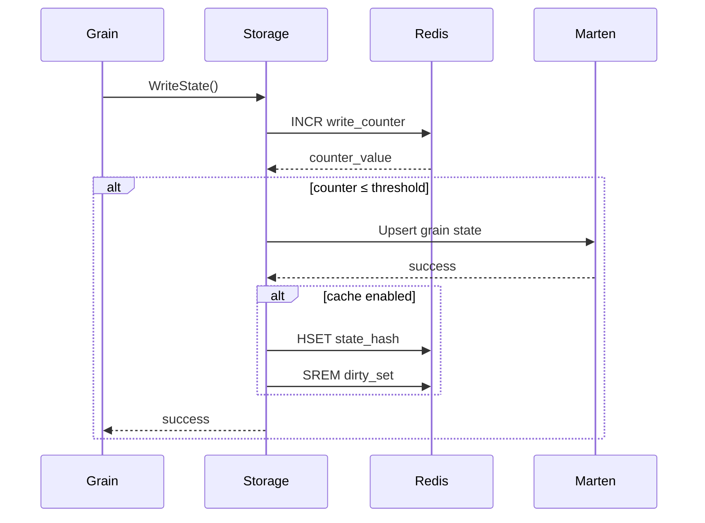
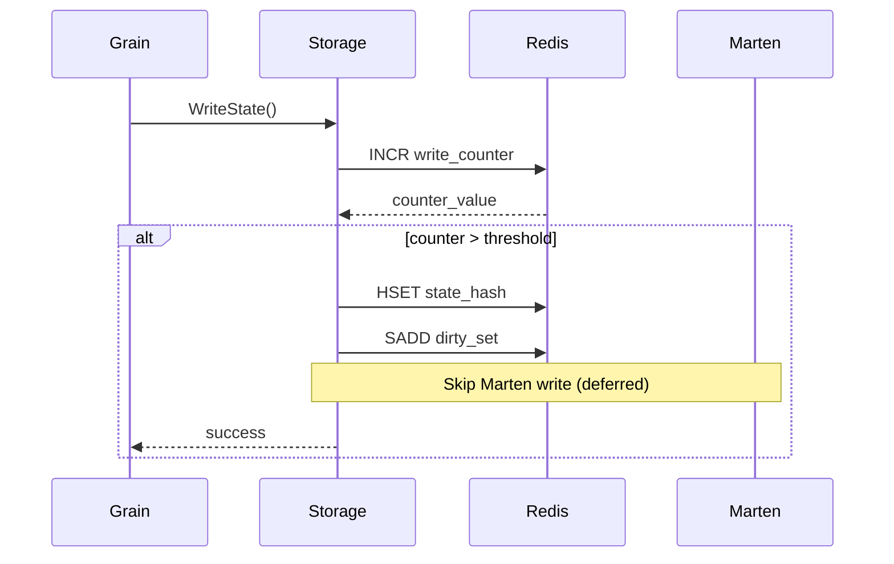
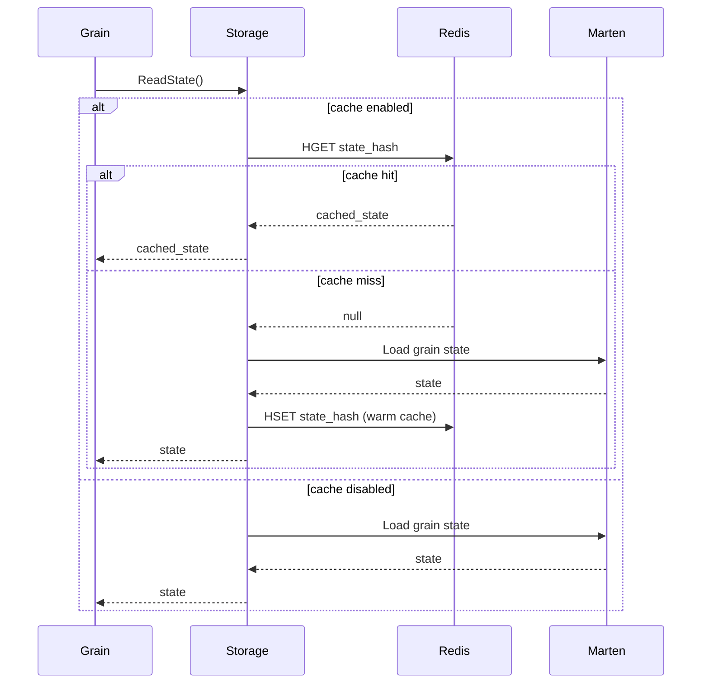
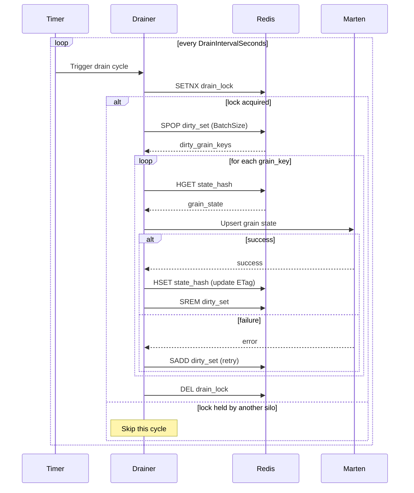

# Elyfe Orleans Marten Providers

An Orleans provider suite backed by Marten (PostgreSQL document store): grain storage with an optional
Redis read-through cache and write-behind overflow, cluster membership, reminders, and a build-time
analyzer for grain-state schema mistakes.

## Packages

All packages ship together under a single GitVersion-derived version — see
[Release & Deployment](#release--deployment). Every package targets `net9.0` and `net10.0`.

| Package | Provides |
|---|---|
| `Elyfe.Orleans.Marten.Persistence` | Grain storage (`IGrainStorage`) plus Redis cache and write-behind |
| `Elyfe.Orleans.Marten.Clustering` | Cluster membership (`IMembershipTable`) and client gateways (`IGatewayListProvider`) |
| `Elyfe.Orleans.Marten.Reminders` | Reminder table (`IReminderTable`) with TimescaleDB-aware schema |
| `Elyfe.Analyzers.Orleans.MartenSchema` | Roslyn analyzer for grain-state and Marten mapping mistakes |

## Features

- **Marten-backed grain storage**: Persistent grain state in PostgreSQL using Marten document store
- **Typed store routing**: Bind a provider to a specific `IDocumentStore` implementation via
  `AddMartenGrainStorage<TStore>`, so each subsystem persists to its own database instead of sharing one
  ambient default store
- **Redis read-through cache**: Optional caching layer for improved read performance
- **Write-behind overflow**: Automatic overflow to Redis cache during writing surges (>100 writes/sec)
- **Background drainer**: Asynchronous persistence from Redis to Marten
- **Multi-tenant support**: Tenant isolation via Orleans RequestContext
- **Marten tenancy per storage**: Configure different `IDocumentStore` instances per storage name using Marten's multi-tenancy features
- **ETag-based concurrency**: Optimistic concurrency control with SHA-256 ETags
- **Backward compatibility**: Automatic migration from old grain ID format
- **Cluster membership**: Marten-backed Orleans membership with atomic compare-and-swap, replacing the
  third-party `Interflare.Orleans.Marten.Clustering`
- **Elyfe reminder storage**: `Elyfe.Orleans.Marten.Reminders` implementing Orleans `IReminderTable` with service-id isolation, ETag deletes, and Timescale-preferred migrations

## Quick Start

### Basic Usage (Marten only)

```csharp
siloBuilder.AddMartenGrainStorage("Default");
```

### Typed Stores (routing a provider to a specific database)

The untyped overloads resolve the unkeyed `IDocumentStore`, which means every provider shares one ambient
store. The generic overloads take the store type instead, so each subsystem can own its own database while
still using this provider:

```csharp
// Register the typed stores themselves (Marten's own API)
services.AddMartenStore<ISmsMartenStore>(options => options.Connection(smsDb));
services.AddMartenStore<IPlatformMartenStore>(options => options.Connection(platformDb));

// Route each Orleans storage provider at the store that owns it
siloBuilder.AddMartenGrainStorage<ISmsMartenStore>("sms");
siloBuilder.AddMartenGrainStorageWithRedis<ISmsMartenStore>("sms-cached");
siloBuilder.AddMartenGrainStorageAsDefault<IPlatformMartenStore>();

// Same idea for the other providers
siloBuilder.UseElyfeMartenClustering<IPlatformMartenStore>();
siloBuilder.UseElyfeMartenReminderService<IPlatformMartenStore>();
```

Prefer this over `UseTenantPerStorage` when subsystems must live in **separate databases** rather than
separate tenants inside one database.

### With Redis Cache and Write-Behind

```csharp
siloBuilder.AddMartenGrainStorageWithRedis("Default", options =>
{
    options.Threshold = 1000;           // Write surge threshold (writes/sec)
    options.BatchSize = 100;            // Drainer batch size
    options.DrainIntervalSeconds = 5;   // Drain check interval
    options.StateTtlSeconds = 300;      // Cache TTL (0 = no expiration)
    options.EnableWriteBehind = true;   // Enable overflow
    options.EnableReadThrough = true;   // Enable cache reads
});
```

### With Marten Multi-Tenancy Per Storage

When you want each storage name to use a different Marten tenant (database schema), enabling Marten's built-in multi-tenancy:

```csharp
// Configure MartenStorageOptions to use storage name as tenant ID
siloBuilder.ConfigureServices(services =>
{
    services.Configure<MartenStorageOptions>(options =>
    {
        options.UseTenantPerStorage = true;
    });
    
    // Register your IDocumentStore with multi-tenancy enabled
    services.AddMarten(opts =>
    {
        opts.Connection("your-connection-string");
        opts.Policies.AllDocumentsAreMultiTenanted();
        // Additional Marten configuration...
    });
});

// Add storage - the storage name will be used as the Marten tenant ID
siloBuilder.AddMartenGrainStorage("SmsStorage");
siloBuilder.AddMartenGrainStorage("EventsStorage");
```

With `UseTenantPerStorage = true`, each storage provider will create Marten sessions scoped to that storage name as the tenant identifier. This provides complete data isolation at the database level using Marten's multi-tenancy capabilities.

## Configuration

### appsettings.json

```json
{
  "ConnectionStrings": {
    "cache": "localhost:6379"
  },
  "WriteBehind": {
    "CacheDatabase": 1,
    "Threshold": 1000,
    "BatchSize": 100,
    "DrainIntervalSeconds": 5,
    "StateTtlSeconds": 300,
    "DrainLockTtlSeconds": 30,
    "EnableWriteBehind": true,
    "EnableReadThrough": true
  }
}
```

### Environment Variables

- `ConnectionStrings__cache`: Redis connection string (if empty, caching is disabled)
- `Orleans__Persistence__Marten__WriteBehind__CacheDatabase`: Redis database number (default: 0)`
- `Orleans__Persistence__Marten__WriteBehind__Threshold`: Write surge threshold (default: 1000)
- `Orleans__Persistence__Marten__WriteBehind__BatchSize`: Drainer batch size (default: 100)
- `Orleans__Persistence__Marten__WriteBehind__DrainIntervalSeconds`: Drain check interval (default: 5)
- `Orleans__Persistence__Marten__WriteBehind__StateTtlSeconds`: Cache TTL in seconds (default: 300)
- `Orleans__Persistence__Marten__WriteBehind__DrainLockTtlSeconds`: Drain lock TTL in seconds (default: 30)
- `Orleans__Persistence__Marten__WriteBehind__EnableWriteBehind`: Enable write-behind overflow (default: true)
- `Orleans__Persistence__Marten__WriteBehind__EnableReadThrough`: Enable read-through cache (default: true)

#### Marten Multi-Tenancy Options

- `Orleans__Persistence__Marten__UseTenantPerStorage`: Use storage name as Marten tenant ID (default: false)

## Architecture

### Redis Data Model

The implementation uses a Hash + Set coalescing pattern:

1. **State Hash** (per storage/tenant): `mgs:{serviceId}:{storageName}{tenantPart}:state`
   - Field: `{grainKey}` (grain ID with slashes replaced by underscores)
   - Value: JSON `{ data, etag, lastModified }`

2. **Dirty Set** (per storage/tenant): `mgs:{serviceId}:{storageName}{tenantPart}:dirty`
   - Members: grain keys pending persistence

3. **Write Counter** (per storage): `mgs:{serviceId}:{storageName}:wcount`
   - Auto-incremented on each writing
   - Expires after 1 second
   - Triggers overflow when > Threshold

4. **Drain Lock** (per storage): `mgs:{serviceId}:{storageName}:drain-lock`
   - Distributed lock for drainer coordination
   - TTL: 30 seconds (configurable)

### Write Paths

#### Write-Through (Normal Operation)


```mermaid
sequenceDiagram
    participant G as Grain
    participant S as Storage
    participant R as Redis
    participant M as Marten
    
    G->>S: WriteState()
    S->>R: INCR write_counter
    R-->>S: counter_value
    
    alt counter ≤ threshold
        S->>M: Upsert grain state
        M-->>S: success
        alt cache enabled
            S->>R: HSET state_hash
            S->>R: SREM dirty_set
        end
        S-->>G: success
    end
```

#### Write-Behind (Overflow)


```mermaid
sequenceDiagram
    participant G as Grain
    participant S as Storage
    participant R as Redis
    participant M as Marten
    
    G->>S: WriteState()
    S->>R: INCR write_counter
    R-->>S: counter_value
    
    alt counter > threshold
        S->>R: HSET state_hash
        S->>R: SADD dirty_set
        Note over S,M: Skip Marten write (deferred)
        S-->>G: success
    end
```

### Read Path


```mermaid
sequenceDiagram
    participant G as Grain
    participant S as Storage
    participant R as Redis
    participant M as Marten
    
    G->>S: ReadState()
    
    alt cache enabled
        S->>R: HGET state_hash
        alt cache hit
            R-->>S: cached_state
            S-->>G: cached_state
        else cache miss
            R-->>S: null
            S->>M: Load grain state
            M-->>S: state
            S->>R: HSET state_hash (warm cache)
            S-->>G: state
        end
    else cache disabled
        S->>M: Load grain state
        M-->>S: state
        S-->>G: state
    end
```

### Background Drainer


```mermaid
sequenceDiagram
    participant T as Timer
    participant D as Drainer
    participant R as Redis
    participant M as Marten
    
    loop every DrainIntervalSeconds
        T->>D: Trigger drain cycle
        D->>R: SETNX drain_lock
        
        alt lock acquired
            D->>R: SPOP dirty_set (BatchSize)
            R-->>D: dirty_grain_keys
            
            loop for each grain_key
                D->>R: HGET state_hash
                R-->>D: grain_state
                D->>M: Upsert grain state
                
                alt success
                    M-->>D: success
                    D->>R: HSET state_hash (update ETag)
                    D->>R: SREM dirty_set
                else failure
                    M-->>D: error
                    D->>R: SADD dirty_set (retry)
                end
            end
            
            D->>R: DEL drain_lock
        else lock held by another silo
            Note over D: Skip this cycle
        end
    end
```

## Tenant Isolation

### Orleans RequestContext Tenancy

Tenant ID is resolved from Orleans `RequestContext`:

```csharp
var tenantId = RequestContext.Get("tenantId") as string;
```

When present, Redis keys include `:tenant:{tenantId}` for cache isolation. The write counter remains global per storage (cluster-wide threshold).

### Marten Multi-Tenancy Per Storage

When `UseTenantPerStorage` is enabled, each storage name becomes a Marten tenant identifier. This leverages Marten's built-in multi-tenancy features to:

- Store data for different storage providers in separate database schemas or logical partitions
- Provide complete data isolation at the database level
- Enable independent schema management per storage provider
- Support different document types and configurations per tenant/storage

Example use case: In a multi-module platform (SMS, Events, Finance), each module can use its own storage with complete data isolation:

```csharp
// Each storage gets its own Marten tenant
siloBuilder.AddMartenGrainStorage("sms");     // Uses "sms" as tenant ID
siloBuilder.AddMartenGrainStorage("events");  // Uses "events" as tenant ID  
siloBuilder.AddMartenGrainStorage("finance"); // Uses "finance" as tenant ID
```

## Failure Modes & Consistency

| Scenario                            | Behavior                                | Durability             |
|-------------------------------------|-----------------------------------------|------------------------|
| Cache read failure                  | Fall back to Marten                     | ✅ No data loss         |
| Cache write failure during overflow | Synchronous write to Marten             | ✅ No data loss         |
| Drainer failure                     | Grain remains dirty, retried next cycle | ✅ Eventual consistency |
| Marten write failure                | Exception propagated to grain           | ✅ No data loss         |
| Redis unavailable                   | Cache disabled, Marten-only mode        | ✅ No data loss         |

### Consistency Guarantees

- **Durability**: All successful grain writes are eventually persisted to Marten
- **Read-after-write**: Reads always return the latest state (cache or DB)
- **Idempotency**: Drainer upserts are idempotent
- **No data loss**: On cache failures during overflow, fallback to synchronous Marten write

## Operations

### Monitoring

Key metrics to monitor:

- **Cache hit rate**: Log level `Debug` shows "Cache hit for grain..."
- **Overflow events**: Log level `Debug` shows "Write overflow detected..."
- **Drain cycles**: Log level `Information` shows "Draining X dirty grain states..."
- **Failures**: Log level `Error` for cache/drain failures

### Scaling

- Write threshold applies **cluster-wide** per storage name
- Multiple silos can drain concurrently (distributed lock coordination)
- Redis and Marten can be scaled independently

### Disabling Cache

Leave the `cache` connection string empty (the same key the provider reads — not `Redis`):

```json
{
  "ConnectionStrings": {
    "cache": ""
  }
}
```

Cache features are automatically disabled; falls back to Marten-only mode.

### Tuning

| Parameter              | Impact                   | Recommendation                       |
|------------------------|--------------------------|--------------------------------------|
| `Threshold`            | Lower = more overflow    | Set to 1.2x expected peak writes/sec |
| `BatchSize`            | Larger = fewer cycles    | 50-200 depending on grain size       |
| `DrainIntervalSeconds` | Lower = less lag         | 5-10 seconds typical                 |
| `StateTtlSeconds`      | Longer = more cache hits | 300-600 for hot grains               |

## Testing

Every suite runs against real infrastructure through Testcontainers (PostgreSQL, Redis), so Docker must be
available. There are **no `Category` traits** — scope runs by project or fully-qualified name.

```bash
# everything, across net9.0 and net10.0
dotnet test Elyfe.Orleans.Marten.Persistence.slnx

# one package
dotnet test test/Elyfe.Orleans.Marten.Persistence.Tests/Elyfe.Orleans.Marten.Persistence.Tests.csproj
dotnet test test/Elyfe.Orleans.Marten.Reminders.Tests/Elyfe.Orleans.Marten.Reminders.Tests.csproj
dotnet test test/Elyfe.Orleans.Marten.Clustering.Tests/Elyfe.Orleans.Marten.Clustering.Tests.csproj

# a single framework while iterating
dotnet test Elyfe.Orleans.Marten.Persistence.slnx -f net10.0

# a single test
dotnet test --filter "FullyQualifiedName~Concurrent_inserts_produce_exactly_one_winner"
```

What the suites cover:

- **Persistence** — key generation and formatting, write-counter gating, cache read/write/dirty/lock, ETag
  generation, read-through cache, write-behind overflow, background drainer persistence, eventual
  consistency, typed-store routing, and data isolation across storage names.
- **Reminders** — service-id isolation, ETag deletes, and Timescale-preferred schema.
- **Clustering** — membership compare-and-swap, stale row-etag and stale table-version rejection,
  heartbeats leaving the table version untouched, defunct-entry cleanup, cluster-scoped deletes,
  concurrent inserts yielding exactly one winner, and gateway filtering.
- **Analyzer** — grain-state schema diagnostics.

## Elyfe Orleans Marten Reminders

Register the reminder provider in the silo:

```csharp
siloBuilder.UseElyfeMartenReminderService(options =>
{
    options.ConnectionString = connectionString;
    options.PreferTimescale = true;
});
```

The provider stores reminders in `reminders.orleans_reminders`. The platform migrator owns production DDL and migrates existing Interflare reminder document rows in place via `043-elyfe-orleans-reminders-timescale.sql`.

TimescaleDB is preferred, not required. When the extension is installed, the migration converts the reminder table to a hypertable partitioned by `start_at`; otherwise the same table and indexes run on plain PostgreSQL.

## Elyfe Orleans Marten Clustering

`Elyfe.Orleans.Marten.Clustering` implements Orleans cluster membership (`IMembershipTable`) and the
client gateway list (`IGatewayListProvider`) on Marten documents. It replaces the third-party
`Interflare.Orleans.Marten.Clustering` package.

```csharp
// Silo — membership in whichever store is the unkeyed default
siloBuilder.UseElyfeMartenClustering();

// Silo — membership pinned to a dedicated infrastructure store
siloBuilder.UseElyfeMartenClustering<IPlatformMartenStore>();

// Client
clientBuilder.UseElyfeMartenClustering<IPlatformMartenStore>();
```

Options (`ElyfeMartenClusteringOptions`):

| Option | Default | Purpose |
|---|---|---|
| `DatabaseSchemaName` | `clustering` | Schema owning both documents |
| `MembershipDocumentAlias` | `orleans_membership` | Silo membership table |
| `ClusterVersionDocumentAlias` | `orleans_cluster_version` | Compare-and-swap anchor |
| `MaxStaleness` | 60s | How long a client may reuse a cached gateway list |

### Guarantees

- **Atomic compare-and-swap.** `InsertRow` and `UpdateRow` write the membership row and bump the
  cluster-version document in a single Marten session. Both documents are mapped with
  `UseOptimisticConcurrency(true)`, and a lost race returns `false` rather than throwing, because
  Orleans' membership protocol depends on that boolean.
- **Heartbeats are cheap.** `UpdateIAmAlive` never bumps the table version; doing so would make every
  heartbeat look like a membership change and churn the cluster.
- **Cluster-scoped identity.** Documents are keyed `{clusterId}:{siloAddress}`, so one database can host
  membership for several clusters.
- **Instants are `DateTimeOffset`.** PostgreSQL rejects `DateTime` with `Kind=Utc` for
  `timestamp without time zone`, so values are normalised at the Orleans boundary.

Schema DDL is owned by the consuming application's migrator, exactly as with reminders — the provider
never auto-creates production tables.

## Release & Deployment

### Versioning

Versions come from **GitVersion** (`6.x`), computed from git history — never hand-edited in a `.csproj`.
The `semVer` output is passed to `dotnet pack` as `PackageVersion`, so all packages ship one version per
release. The latest published release is **v1.1.0**.

### Pipeline

`.github/workflows/nuget-publish.yml` has three jobs:

| Job | Runs on | Does |
|---|---|---|
| `test` | push to `main`, **and every pull request** | restore, build, `dotnet test` across `net9.0`+`net10.0`, publishes a TRX report |
| `build` | pull requests and published releases | GitVersion, build, pack **all four** packages, upload the `nupkg` artifact |
| `publish` | published releases only | OIDC login to NuGet for a short-lived key, then `dotnet nuget push` |

`pull_request` is deliberately **not** filtered to `main`, because stacked PRs target their parent
feature branch and would otherwise get no CI at all.

### Cutting a release

1. Merge the work into `main` and confirm the `test` job is green.
2. Create a **GitHub Release** and publish it. Publishing (not tagging alone) is what triggers `publish`.
3. `build` recomputes the version with GitVersion, packs every project, and `publish` pushes to NuGet.

### Packaging invariant

Every project under `src/` is packable (`IsPackable=true` in `src/Directory.Build.props`) and inherits
the shared README, icon, and licence. **Adding a project under `src/` therefore requires adding a matching
`dotnet pack` line to the `Pack Projects` step**, otherwise it builds, tests, and silently never ships.

## Migration Guide

### From Plain Marten Storage

1. Add Redis connection string to appsettings
2. Replace `AddMartenGrainStorage` with `AddMartenGrainStorageWithRedis`
3. Deploy with `EnableWriteBehind: false` initially (cache only)
4. Monitor cache hit rate
5. Enable write-behind once confident

### Backward Compatibility

Old grain IDs (plain `GrainId.ToString()`) are automatically migrated to new format (`{serviceId}_{grainId}`) on first read.

## License

See LICENSE file in repository root.
